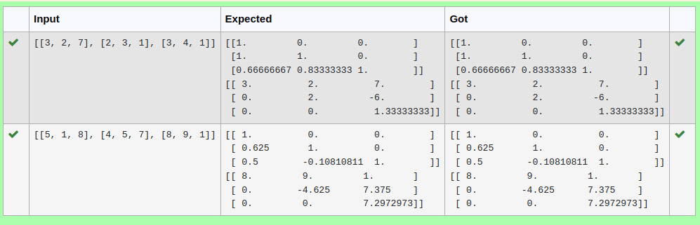

# LU Decomposition 

## AIM:
To write a program to find the LU Decomposition of a matrix.

## Equipments Required:
1. Hardware – PCs
2. Anaconda – Python 3.7 Installation / Moodle-Code Runner

## Algorithm:
1.Read the elements of augmented matrix into arrays a and b 

2.Calculate elements of L and U 

3.Print elements of L and U 

4.Find V by solving LV = B by forward substitution 

5.Find X by solving UX = V by backward substitution 

6.Print Array X as the solution

## Program:

Developed by:sarvesh.s

RegisterNumber: 22003029

(i) To find the L and U matrix
```
from scipy.linalg import lu
A = eval(input())
P,L,U = lu(A)
print(L)
print(U)

```
(ii) To find the LU Decomposition of a matrix

```
from scipy.linalg import lu_factor,lu_solve
A = eval(input())
B = eval(input())
lu,piv=lu_factor(A)
x = lu_solve((lu,piv),B)
print(x)

```

## Output (To find the L and U matrix):


## Output (To find the LU Decomposition of a matrix):


## Result:
Thus the program to find the LU Decomposition of a matrix is written and verified using python programming.

